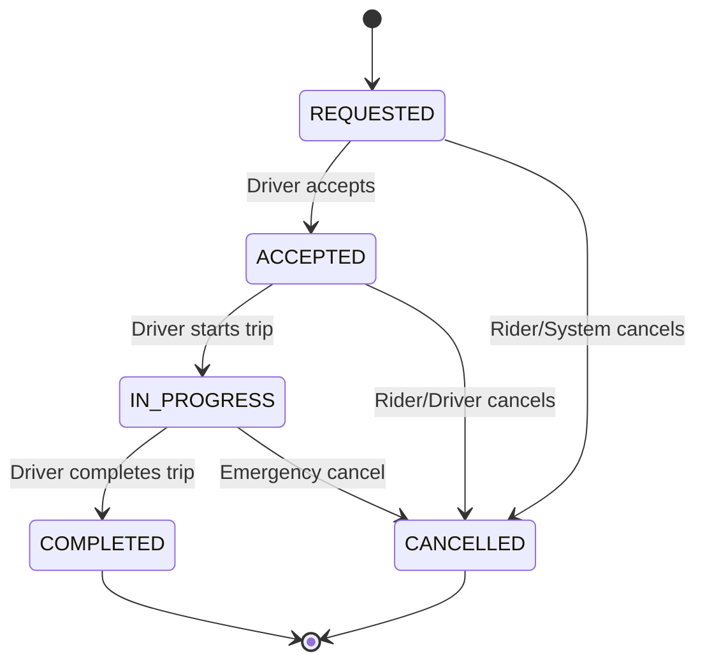

# Ride Booking App — Low Level Design (Java)

A complete Java implementation following **Controller-Service-Repository (CSR)** architecture with **State**, **Strategy**, and **Repository** design patterns.

## Architecture

```mermaid
graph TD
    subgraph Controllers
        RC[RideController]
        DC[DriverController]
        PC[PaymentController]
    end

    subgraph Services
        RS[RideService]
        MS[MatchingService]
        PS[PricingService]
        PAS[PaymentService]
        LS[LocationService]
        DS[DriverService]
        LKS[LockService]
        NS[NotificationService]
        MPS[MapService]
    end

    subgraph Repositories
        RR[RideRepository]
        RIR[RiderRepository]
        DR[DriverRepository]
        LR[LocationRepository]
    end

    subgraph Strategies
        DMS[DriverMatchingStrategy]
        PRS[PricingStrategy]
        PGP[PaymentGatewayProvider]
        PGR[PaymentGatewayRouter]
    end

    subgraph State Machine
        RST[RideState]
        REQ[RequestedState]
        ASG[AssignedState]
        ACC[AcceptedState]
        INP[InProgressState]
        COM[CompletedState]
        CAN[CancelledState]
    end

    RC --> RS
    RC --> PS
    DC --> RS
    DC --> DS
    DC --> LS
    PC --> PAS

    RS --> RR
    RS --> RIR
    RS --> PS
    RS --> PAS
    RS --> MS
    RS --> DS
    RS --> LS
    RS --> LKS
    RS --> NS

    MS --> DR
    MS --> RR
    MS --> DMS
    MS --> LKS
    MS --> NS

    PS --> PRS
    PS --> MPS

    PAS --> PGR
    PAS --> RR
    PAS --> MS
    PAS --> NS

    PGR --> PGP

    LS --> DR
    LS --> LR

    DS --> DR

    RS -.-> RST
    RST --> REQ
    RST --> ASG
    RST --> ACC
    RST --> INP
    RST --> COM
    RST --> CAN
```



## Ride State Machine



## Project Structure

```
src/
├── model/
│   ├── enums/          → RideStatus, PaymentStatus, PaymentType, DriverStatus
│   ├── Location.java
│   ├── Rider.java
│   ├── Driver.java
│   └── Ride.java
├── dto/                → RideRequest, FareEstimateRequest/Response, RideStatusResponse, etc.
├── state/              → RideState interface + 6 concrete states
├── strategy/
│   ├── matching/       → DriverMatchingStrategy + NearestDriverStrategy
│   ├── pricing/        → PricingStrategy + BasePricingStrategy + SurgePricingStrategy
│   └── payment/        → PaymentGatewayProvider + Stripe/Razorpay/PayPal/Mock + Router
├── repository/         → RideRepository, RiderRepository, DriverRepository, LocationRepository
├── service/            → RideService, MatchingService, PricingService, PaymentService, etc.
├── controller/         → RideController, DriverController, PaymentController
└── Main.java           → End-to-end demo
```

## Design Patterns

| Pattern | Where | Purpose |
|---------|-------|---------|
| **State** | `state/` | Guards ride lifecycle transitions |
| **Strategy** | `strategy/matching/` | Pluggable driver matching (nearest, ETA) |
| **Strategy** | `strategy/pricing/` | Pluggable fare calculation (base, surge) |
| **Strategy** | `strategy/payment/` | Pluggable payment gateways (Stripe, Razorpay, PayPal) |
| **Repository** | `repository/` | Data access abstraction |
| **Observer** | `NotificationService` | Location updates → rider notifications |

## API Endpoints

| Method | Endpoint | Controller | Description |
|--------|----------|------------|-------------|
| `GET` | `/api/rides/fare-estimate` | RideController | Get upfront fare estimate |
| `POST` | `/api/rides/request` | RideController | Request a new ride |
| `GET` | `/api/rides/{rideId}/status` | RideController | Poll ride status |
| `POST` | `/api/rides/{rideId}/cancel` | RideController | Cancel a ride |
| `POST` | `/api/rides/{rideId}/accept` | DriverController | Accept ride request |
| `POST` | `/api/rides/{rideId}/decline` | DriverController | Decline ride request |
| `POST` | `/api/rides/{rideId}/start` | DriverController | Start the trip |
| `POST` | `/api/rides/{rideId}/complete` | DriverController | Complete the trip |
| `POST` | `/api/drivers/{id}/location` | DriverController | Update GPS location |
| `POST` | `/api/drivers/{id}/online` | DriverController | Go online |
| `POST` | `/api/drivers/{id}/offline` | DriverController | Go offline |
| `POST` | `/api/payments/callback` | PaymentController | Payment gateway callback |

## Build & Run

```bash
javac -d out $(find src -name "*.java")
java -cp out Main
```
